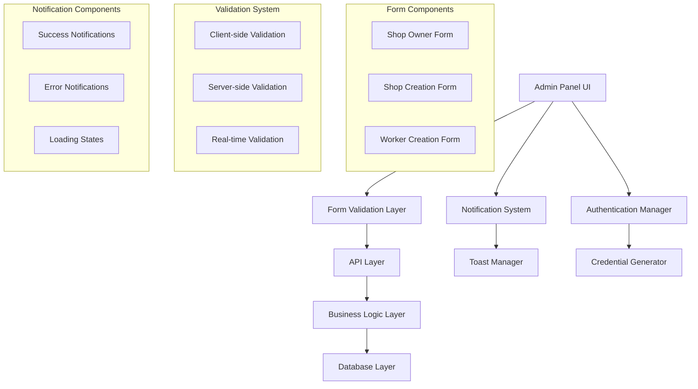

# Design Document

## Overview

This design addresses critical usability and functionality issues in the admin panel's shop management system. The current implementation uses browser alerts for feedback, has inconsistent form validation, and creates a confusing workflow for shop owner and shop creation. This design proposes a comprehensive solution that improves user experience, implements proper validation, and creates a streamlined workflow.

## Architecture

### Current System Analysis

The existing system has several architectural issues:

1. **Notification System**: Uses browser `alert()` calls instead of in-app notifications
2. **Form Validation**: Inconsistent client-side validation with poor error handling
3. **User Feedback**: No loading states or progress indicators
4. **Workflow Issues**: Confusing shop owner creation process that requires duplicate data entry
5. **Authentication Flow**: No automatic credential generation or secure display

### Proposed Architecture



## Components and Interfaces

### 1. Enhanced Notification System

**Component: `NotificationProvider`**
```typescript
interface NotificationContextType {
  showNotification: (notification: NotificationData) => void
  hideNotification: (id: string) => void
  notifications: Notification[]
}

interface NotificationData {
  id?: string
  type: 'success' | 'error' | 'warning' | 'info'
  title: string
  message?: string
  duration?: number
  persistent?: boolean
}
```

**Component: `NotificationContainer`**
- Renders stacked notifications in top-right corner
- Auto-dismisses after configurable duration
- Supports manual dismissal
- Animates in/out transitions

### 2. Form Validation System

**Component: `ValidatedForm`**
```typescript
interface FormValidationConfig {
  fields: Record<string, FieldValidation>
  onSubmit: (data: any) => Promise<void>
  onValidationError: (errors: ValidationErrors) => void
}

interface FieldValidation {
  required?: boolean
  pattern?: RegExp
  minLength?: number
  maxLength?: number
  customValidator?: (value: any) => string | null
  formatter?: (value: string) => string
}
```

**Real-time Validation Features:**
- Phone number auto-formatting (+92-XXX-XXXXXXX)
- Email format validation
- CNIC format validation (42101-1234567-8)
- Postal code validation (5 digits)
- Required field highlighting

### 3. Streamlined Shop Owner Creation

**Component: `ShopOwnerCreationDialog`**
```typescript
interface ShopOwnerFormData {
  // Personal Information
  name: string
  email: string
  phone: string
  cnic: string
  
  // Address Information
  address: string
  city: string
  province: string
  
  // Business Information
  businessName?: string
  
  // Generated Credentials
  password: string
}
```

**Features:**
- Tabbed interface for organized data entry
- Auto-generation of secure temporary passwords
- Real-time validation with immediate feedback
- Success notification with credential display

### 4. Enhanced Shop Creation Workflow

**Component: `ShopCreationDialog`**
```typescript
interface ShopCreationFormData {
  // Basic Information
  name: string
  address: string
  city: string
  province: string
  postalCode: string
  phone: string
  email: string
  
  // Owner Selection
  ownerId: string
  
  // Business Details
  licenseNumber?: string
  gstNumber?: string
  
  // Settings
  settings: ShopSettings
}
```

**Workflow Improvements:**
- Owner selection dropdown with search functionality
- Pre-population of owner contact details
- Inline owner creation option
- Validation prevents duplicate shop names
- Auto-generation of shop codes

### 5. Worker Management System

**Component: `WorkerCreationDialog`**
```typescript
interface WorkerFormData {
  // Personal Information
  name: string
  email: string
  phone: string
  cnic: string
  
  // Work Assignment
  shopId: string
  position: string
  permissions: WorkerPermission[]
  
  // Generated Credentials
  password: string
}
```

## Data Models

### Enhanced User Model
```typescript
interface User {
  id: string
  email: string
  name: string
  phone: string
  cnic: string
  address: string
  city: string
  province: string
  businessName?: string
  role: UserRole
  status: UserStatus
  emailVerified: Date | null
  createdAt: Date
  updatedAt: Date
  
  // Relationships
  ownedShops?: Shop[]
  workerAssignments?: ShopWorker[]
}
```

### Enhanced Shop Model
```typescript
interface Shop {
  id: string
  name: string
  code: string
  address: string
  city: string
  province: string
  postalCode: string
  phone: string
  email: string
  licenseNumber?: string
  gstNumber?: string
  status: ShopStatus
  
  // Relationships
  ownerId: string
  owner: User
  workers: ShopWorker[]
  
  // Settings
  settings: ShopSettings
  
  // Timestamps
  createdAt: Date
  updatedAt: Date
}
```

### Notification Model
```typescript
interface Notification {
  id: string
  type: 'success' | 'error' | 'warning' | 'info'
  title: string
  message?: string
  duration: number
  persistent: boolean
  timestamp: Date
  dismissed: boolean
}
```

## Error Handling

### Client-Side Error Handling
```typescript
interface ValidationError {
  field: string
  message: string
  code: string
}

interface FormErrors {
  [fieldName: string]: string[]
}

class FormValidator {
  validateField(field: string, value: any, rules: FieldValidation): string | null
  validateForm(data: any, config: FormValidationConfig): FormErrors
  formatPhoneNumber(phone: string): string
  formatCNIC(cnic: string): string
}
```

### Server-Side Error Handling
```typescript
interface APIError {
  error: string
  details?: ValidationError[]
  code: string
  timestamp: Date
}

class APIErrorHandler {
  handleValidationError(error: ZodError): APIError
  handleDuplicateError(error: PrismaError): APIError
  handleGenericError(error: Error): APIError
}
```

## Testing Strategy

### Unit Tests
- Form validation logic
- Phone number formatting
- CNIC validation
- Email validation
- Password generation

### Integration Tests
- Shop owner creation workflow
- Shop creation with owner selection
- Worker assignment process
- Notification system
- API error handling

### End-to-End Tests
- Complete shop owner creation flow
- Shop creation with new owner
- Shop creation with existing owner
- Worker creation and assignment
- Form validation scenarios
- Error handling scenarios

### Test Scenarios
```typescript
describe('Shop Owner Creation', () => {
  it('should create shop owner with valid data')
  it('should validate required fields')
  it('should format phone number automatically')
  it('should check for duplicate email/CNIC')
  it('should generate secure credentials')
  it('should show success notification')
  it('should handle API errors gracefully')
})

describe('Shop Creation', () => {
  it('should create shop with existing owner')
  it('should allow inline owner creation')
  it('should validate shop-specific fields')
  it('should prevent duplicate shop names')
  it('should establish owner-shop relationship')
})

describe('Notification System', () => {
  it('should display success notifications')
  it('should display error notifications')
  it('should auto-dismiss notifications')
  it('should stack multiple notifications')
  it('should allow manual dismissal')
})
```

## Security Considerations

### Password Security
- Generate cryptographically secure temporary passwords
- Hash passwords using bcrypt with salt rounds ≥ 12
- Display credentials only once for security
- Force password change on first login

### Data Validation
- Server-side validation for all inputs
- SQL injection prevention through Prisma ORM
- XSS prevention through input sanitization
- CSRF protection through NextAuth

### Access Control
- Role-based access control (RBAC)
- Super Admin only access for user creation
- Shop-specific data isolation
- Audit logging for all administrative actions

## Performance Considerations

### Client-Side Optimization
- Debounced real-time validation
- Lazy loading of shop owner dropdown
- Optimistic UI updates
- Form state management with React Hook Form

### Server-Side Optimization
- Database query optimization
- Pagination for large datasets
- Caching for frequently accessed data
- Connection pooling for database

### API Design
- RESTful API design
- Proper HTTP status codes
- Consistent error response format
- Request/response compression

## Implementation Phases

### Phase 1: Notification System
- Replace browser alerts with in-app notifications
- Implement notification context and provider
- Create notification components
- Add loading states to forms

### Phase 2: Form Validation Enhancement
- Implement real-time validation
- Add phone number and CNIC formatting
- Improve error message display
- Add form submission states

### Phase 3: Shop Owner Creation Improvement
- Redesign shop owner creation form
- Add tabbed interface for better organization
- Implement credential generation and display
- Add success/error handling

### Phase 4: Shop Creation Workflow
- Improve owner selection process
- Add inline owner creation option
- Implement data pre-population
- Add shop code generation

### Phase 5: Worker Management
- Create worker creation interface
- Implement shop-worker assignment
- Add worker permission management
- Create worker credential system

### Phase 6: Testing and Polish
- Comprehensive testing suite
- Performance optimization
- Security audit
- User experience refinement